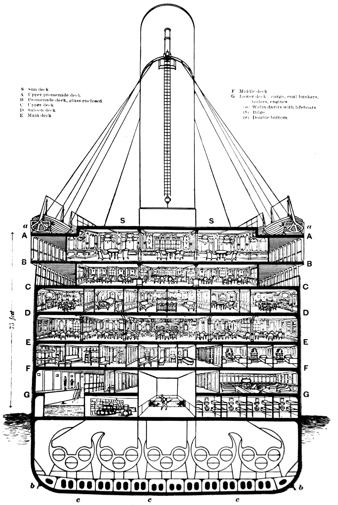

```{r global_options, include = FALSE}
knitr::opts_chunk$set(eval = TRUE, message = FALSE, warning = FALSE)
```

``` {r, echo = FALSE}
library(tidyverse)
```

#1.Group members: 

An Phi and Kaifeng Yang

#2.Title: 

A Study In Disaster

#3.Purpose:  
We want to study the relationship between a passenger\'s background and his/her chance of survival in a shipwreck. One interesting thing to look at is how class and gender may affect the survivor rate. This might also (in a fun way) relate to us in the modern context, for example: we can use our own info to check if we might survive in such a shipwreck as the titanic. We can also study how different aspects(gender, age, socio-economic status) of a person might affect their chance of survival.

#4.Data:  
We will use a data containing the information of all the members on board when Titanic got into the accident. The data is obtained from [Kaggle](https://www.kaggle.com/c/titanic/data). It is also available in R with the __titanic__ package. This data set contains 1309 rows, and 11 variables. Each row represents a passenger who was on the Titanic. 

#5. Population:  
For the data set, each observational unit is a passenger who was on the Titanic. 
We want to generalize this study to passengers of all ships at the time of 1800s. To be specific, our population will be wealthy Europeans and Americans as well as the lower class workers on the ship. This is because traveling on Titanic can be regarded as a luxury at that time, so people who can afford to buy a ticket are wealthy people, and other people on Titanic are mainly workers on the ship. Also, since Titanic was going across the Atlantic Ocean, we can only generalize to Europeans and Americans. Hopefully, through this study, we can estimate their odds of survival in case of a shipwreck.

#6. Variables:
This data involves Titanic's passengers' basic information, such as their age and gender as well as their economic background, family relations and a boolean indicating if they survive the disaster or not.

``` {r table-general-info, include = TRUE, echo = FALSE, results = "asis"}
general_info <- read.csv("data/meta.csv", stringsAsFactors = FALSE, na.strings = "NA")
general_info[is.na(general_info)] <- ""
knitr::kable(
  general_info,
  col.names = c("Name", "Type", "Unit", "Meaning", "Value/Range", "Remark"),
  align = c("l", "l", "l", "l", "l", "l"),
  digits = 0,
  booktabs = TRUE
  #format = "html"
  )
```

#7. Response Variable:   
Our response variable will be __survival__, which indicates whether or not the person survived, which is represented using 0's and 1's, where 0 means that the person did not survive, and 1 means the person did. 

Since our response variable is not continuous, we are going to use logistic regression instead of linear regression. By using logistic regression, we will produce the probability of survival given the explanatory variables. The general form of a logistic regression looks like $ln(\frac{p}{1-p})=\alpha_0+\alpha_1x_1+\alpha_2x_2+\dots +\alpha_nx_n$, where $p$ is the probability of our outcome, and $x_1, x_2, \dots, x_n$ are explanatory variables. Our $p$ will then be calculated by the formula: $p = \frac{1}{1+e^{-RHS}}$, where $RHS=\alpha_0+\alpha_1x_1+\alpha_2x_2+\dots +\alpha_nx_n$. This is the Sigmoid function, which has range of [0, 1] and can be used in replacement of the step function since it gets really steep near 0 (see the diagram below), effectively only allow the possible value of $p$ to be either 1 or 0. Hence, it can be used to handle the discreet explanatory variable "survival" in this case.

<center>
``` {r, echo = FALSE}
sigmoid = function(x) {
   1 / (1 + exp(-x*10))
}
x <- seq(-5, 5, 0.01)
plot(x, sigmoid(x), col=rgb(73, 133, 233, maxColorValue=255), type = "l",  lwd = 3)
```
</center>


#8. Explanatory Variable: 
Our explanatory variables include __passenger class, gender, age, number of siblings and spouses, number of parents and children, the ticket fare and the port of embarkation__. We believe that those variables might play a role in the survival chance of the passenger on the Titanic.

Variables such as __passenger name__ and __ticket number__ play the role of row identifiers, which means each passenger has an unique row number and name. As such, these variables are not so useful for our purpose and will not be considered as explanatory variables.

Last but not least, we will consider if we should take __cabin number__ as an explanatory variable. This variable might be very crucial in the sense that if we have a layout of the Titanic and being able to figure out the time each passenger takes to go to the rescue site, this derived data would actually crucial to our study. Unfortunately, this derivation might prove challenging due to the following 2 reasons. First, there was no information from the metadata of the data set about exactly what the cabin number actually means. If the cabin number is the original cabin that the passengers bought ticket for, then this is not so useful since richer people would be able to get higher cabin and thus closer to the lifeboat (see the diagram from White Star Line). Second, there are a lot of missing data--we only have the cabin number info of 296 / 1309 passengers. For those mentioned reasons, we will __not__ take __cabin number__ as one of our explanatory variable.


<center>{width=700px}</center>


#9. References:
1. [Statistical Consultants - Titatnic Fare Data](http://www.statisticalconsultants.co.nz/blog/titanic-fare-data.html)
2. [CRAN - Package 'titanic'](https://cran.r-project.org/web/packages/titanic/titanic.pdf)
3. [Kaggle - Titanic: Machine Learning from Disaster](https://www.kaggle.com/c/titanic/data)
4. [Encyclopedia Titanica - Titanic Deckplan](https://www.encyclopedia-titanica.org/titanic-deckplans)


