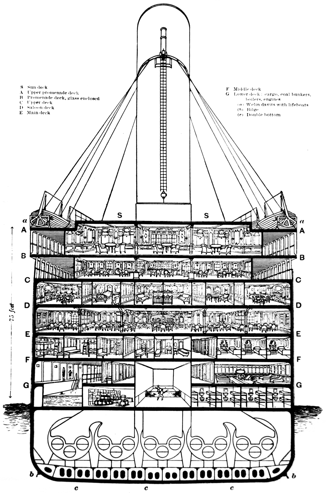

```{r echo = FALSE, include = FALSE}
#install.packages("revealjs")
#install.packages("ResourceSelection")
library(tidyverse)
library(oilabs)
library(gsheet)
library(GGally)
library(ResourceSelection)
titanic <- gsheet2tbl('https://docs.google.com/spreadsheets/d/1Cz3wnwugHApFXO0ogMLtBe5CzD_Uu1q8YBPpZPS2R3U/edit?usp=sharing')
```


# Introduction {data-transition="zoom"}

## Our Purpose
<div class="content">
- What made a survivor?
- Can we survive?!
</div>

## The Dataset
<div class="content">
- from Kaggle
- 1309 rows
- 11 variables
<div>


## The Ship
<div class="content img-ship-cross-section">

</div>


# The Data

## Variables

``` {r table-general-info, include = TRUE, echo = FALSE, results = "asis"}
general_info <- read.csv("meta.csv", stringsAsFactors = FALSE, na.strings = "NA")
general_info[is.na(general_info)] <- ""
knitr::kable(
  general_info,
  col.names = c("Name", "Type", "Unit", "Value/Range"),
  align = c("l", "l", "l", "l"),
  digits = 0,
  booktabs = TRUE
  #format = "html"
  )
```

## Correlation Investigation

<div class="scatter_plot_matrix">
```{r, warning=FALSE, message=FALSE, echo=FALSE, fig.width = 14, fig.height=14}
names<-c("Has survived", "Gender", "Age", "No. of Siblings & Spouses", "No. of Parents & Children", "Passenger Class", "Fare", "Embarked From")

titanic %>%
  select(-passenger_id) %>%
  ggpairs(lower = list(continuous=wrap("points", position="jitter", size=0.5, alpha=0.8)), columnLabels = names)

```
</div>

# Logistic Regression 

##  Formula
<div class="content">
 $$ln(\frac{p}{1-p})= ln(odds) = \alpha_0+\alpha_1x_1+\alpha_2x_2+\dots +\alpha_nx_n = D$$
 $$p = \frac{1}{1 + e^{-D}}$$
</div>

##  Graph
``` {r, echo = FALSE}
sigmoid = function(x) {
   1 / (1 + exp(-x*10))
}
x <- seq(-5, 5, 0.005)
plot(x, sigmoid(x), col="#663248", type = "l",  lwd = 3)
```

##  R's Function
<div class="content">
```{r, echo=TRUE, eval=FALSE} 
glm(formula, family = binomial(link = "logit")), data, ...)
```
</div>


# Backward Search


## The "Best" Model
<div class="content big-code">
``` {r, echo = FALSE}
m_best_search <- glm(has_survived ~ gender + age + number_of_siblings_and_spouses + passenger_class + embarked_from, data = titanic, family = binomial(link = "logit"))
summary(m_best_search)
```
</div>

## The Regression Line
<div class="content small-equation">
$$ln(odds) = 4.86097 \\ - 2.60736 \times gendermale \\ -2.00712 \times age[19,55] \\ -3.10763 \times age[56, above) \\ -1.76429 \times age[6,18] \\ -2.21886\times agemissing \\ -0.35361 \times number\_of\_siblings\_and\_spouses \\ -0.91904\times passenger\_classsecond \\ -1.77251\times passenger\_classthird \\ -0.47350\times embarked\_fromQ  \\ -0.67719\times embarked\_fromS$$
</div>


# Model Evaluation


## The Diagnostics
```{r, echo=FALSE} 
qplot(x = .fitted, y = residuals(m_best_search, type="response") , data = m_best_search) +
  geom_hline(yintercept = 0, linetype = "dashed") +
  xlab("Fitted values") +
  ylab("Residuals")
```


## Hosmer-Lemeshow goodness-of-fit test
<div class="content">
- Treating 0 as failure and 1 as success
- Divide the probability range [0,1] into bin(s)
- Conduct goodness-of-fit test on each bin
- The null hypothesis is: "The observed and the expected success proportions are the same for each bin"
</div>

## The Bin(s)
<div class="content big-code">
```{r, echo=FALSE}
hl_best_search <- hoslem.test(titanic$has_survived, fitted(m_best_search), g=8)
data.frame(as.data.frame.matrix(hl_best_search$observed), as.data.frame.matrix(hl_best_search$expected)) 
hl_best_search
```
</div>


# Feature Selection


## Age vs. Gender


```{r, warning=FALSE, message=FALSE, echo=FALSE, include = TRUE}
mauveSushiCols <- colorRampPalette(c("white", "#663248"))
gender.1<-as.data.frame(mosaic::tally(age~gender, data=titanic, format="percent"))
gender.2<-as.data.frame(mosaic::tally(passenger_class~gender, data=titanic, format="percent"))
gender.3<-as.data.frame(mosaic::tally(number_of_siblings_and_spouses ~gender, data=titanic, format="percent"))
gender.4<-as.data.frame(mosaic::tally(embarked_from~gender, data=titanic, format="percent"))

p1<-ggplot(gender.1, aes(x=gender, y=Freq, fill=age))+
  geom_bar(stat = "identity")+
  scale_fill_manual("", values = mauveSushiCols(5), labels =c("missing", "[0,5]", "[6,18]", "[19,55]", "[56, above)"))+
  #ggtitle("Age")+
  xlab("")+
  ylab("Percentage")
p1
```


## Passenger Class vs. Gender
```{r, warning=FALSE, message=FALSE, echo=FALSE, include = TRUE}
p2<-ggplot(gender.2, aes(x=gender, y=Freq, fill=passenger_class))+
  geom_bar(stat = "identity")+
  scale_fill_manual("", values = mauveSushiCols(3), labels=c("first", "second", "third"))+
  #ggtitle("Passenger Class")+
  xlab("")+
  ylab("Percentage")
p2
```


## Number of Siblings and Spouses vs. Gender
```{r, warning=FALSE, message=FALSE, echo=FALSE, include = TRUE}
p3<-ggplot(gender.3, aes(x=gender, y=Freq, fill=number_of_siblings_and_spouses))+
  geom_bar(stat = "identity")+
  scale_fill_manual("", values = mauveSushiCols(7), labels=c(0,1,2,3,4,5,8))+
  #ggtitle("Number of Siblings and Spouses")+
  xlab("")+
  ylab("Percentage")
p3
```


## Embarked From vs. Gender
```{r, warning=FALSE, message=FALSE, echo=FALSE, include = TRUE}
p4<-ggplot(gender.4, aes(x=gender, y=Freq, fill=embarked_from))+
  geom_bar(stat = "identity")+
  scale_fill_manual("", values = mauveSushiCols(3), labels=c("Cherbourg", "Queenstown", "Southampton"))+
  #ggtitle("Embarked From")+
  xlab("")+
  ylab("Percentage")
p4
```


## Passenger Class vs. Embarked From
```{r, warning=FALSE, message=FALSE, echo=FALSE, include = TRUE}
pclass<-as.data.frame(mosaic::tally(passenger_class~embarked_from, data=titanic, format="percent"))
p5<-ggplot(pclass, aes(x=embarked_from, y=Freq, fill=passenger_class))+
  geom_bar(stat = "identity")+
  scale_fill_manual("", values = mauveSushiCols(3), labels=c("first", "second", "third"))+
  #ggtitle("Embarked From")+
  xlab("")+
  ylab("Percentage")+
  scale_x_discrete(labels=c("Cherbourg", "Queenstown", "Southampton"))
p5
```


# The Best Models

## The "Sexed" Model
<div class="content small-code">
```{r, echo = FALSE}
m_best_w_gender <- glm(has_survived ~ gender + number_of_siblings_and_spouses, data = titanic, family = binomial(link = "logit"))
summary(m_best_w_gender)
hl_best_w_gender <- hoslem.test(titanic$has_survived, fitted(m_best_w_gender), g=8)
hl_best_w_gender
```
</div>

## The "Sexed" Line 
<div class="content small-equation">
$$ln(odds) = 1.1606\\ - 2.5131 \times gendermale\\ -0.2615 \times number\_of\_siblings\_and\_spouses$$
</div>

## The "Sexless" Model
<div class="content small-code">
``` {r, echo = FALSE}
m_best_wo_gender <- glm(has_survived ~ passenger_class + age + number_of_siblings_and_spouses + embarked_from, data = titanic, family = binomial(link = "logit"))
summary(m_best_wo_gender)
hl_best_wo_gender <- hoslem.test(titanic$has_survived, fitted(m_best_wo_gender), g=8)
hl_best_wo_gender
```
</div>

## The "Sexless" Line 
<div class="content small-equation">
$$ln(odds) = 2.86333\\ 
-0.79637 \times passenger\_classsecond\\  
-1.72612 \times passenger\_classthird\\ 
-1.79335 \times age[19,55]\\ 
-2.90927 \times age[56, above)\\ 
-1.29812 \times age[6,18]\\ 
-2.16215 \times agemissing\\ 
-0.13932\times number\_of\_siblings\_and\_spouses\\  
+  0.20219\times embarked\_fromQ \\
-0.67714 \times embarked\_fromS$$
</div>


# Conclusion

## What about us?
<div class="content img-ship-sinking">

</div>